# AI Compliance Checker

<p align="center">
  <em>An autonomous multi-agent system built to streamline regulatory compliance for financial institutions.</em>
</p>

## 📖 Project Overview

The **AI Compliance Checker** is an intelligent pipeline designed to bridge the gap between rapidly evolving regulatory announcements (e.g., RBI circulars) and internal policy enforcement.

**The Problem It Solves:**
When central banks and regulators issue new circulars, institutions struggle to manually map dense, legal regulatory changes against their own vast oceans of internal compliance docs and product catalogs. This system autonomously:
1. **Detects changes** between raw external circulars and previous versions.
2. **Maps impacts** using a local RAG (Retrieval-Augmented Generation) pipeline against internal company documents.
3. **Drafts contextual amendments** to align internal policies with the newest regulations.
4. **Highlights risk & estimates fines** using a locally run, customized LLM.

## 📂 Folder Structure

```text
Compliance-Checker/
├── backend/                  # Python FastAPI Backend
│    ├── main.py              # API Endpoints (FastAPI)
│    ├── crew.py              # Core Multi-Agent & Orchestrator Logic
│    ├── requirements.txt
│    └── data/                # Data storage (Ignored by Git, folder structure maintained)
│         ├── raw_circulars/      # Place NEW/incoming RBI circulars (PDFs) here
│         ├── previous_circulars/ # Place PREVIOUS/baseline RBI circulars (PDFs) here
│         ├── company_docs/       # Place INTERNAL company policies & product catalogs here
│         └── chroma_db/          # Automatically maintained Vector Database for RAG
├── shared_data/              # Contains runtime output logs (e.g., latest_report.json)
├── frontend/                 # Frontend Dashboard (Next.js/React)
├── .env.example              # Environment variables template
└── .gitignore 
```

## 🚀 Setup Instructions

### 1. Clone the Repository
```bash
git clone <your-repository-url>
cd Compliance-Checker
```

### 2. Configure Environment Variables
```bash
cp .env.example .env
```
Ensure you have `OLLAMA_BASE_URL` properly pointing to your target instance (e.g., `http://localhost:11434`) and define `OLLAMA_MODEL` (e.g., `llama3.1:8b`).

### 3. Backend Setup
Create an isolated Python environment and install the required dependencies:

```bash
python3.11 -m venv venv
source venv/bin/activate
pip install -r backend/requirements.txt
```

### 4. Run the Application
**Backend:**
```bash
# Terminal 1: Start the FastAPI Server
source venv/bin/activate
uvicorn backend.main:app --reload --port 8000
```
**Trigger the Pipeline Offline (or use Frontend):**
```bash
# Terminal 2: Trigger standard run
curl -X POST http://localhost:8000/run_compliance_crew
```

## 🔄 Data Workflow & Input Placement

To use the system locally, ensure PDFs are correctly distributed in the `backend/data/` structure:

*   **⚠️ `backend/data/raw_circulars/`**
    *   Place the *newest incoming* regulatory circulars (e.g., `RBI-2026-update.pdf`) here. 
*   **⏪ `backend/data/previous_circulars/`**
    *   Place the *previously issued/historical* version of that same circular here. The LLM engine uses this to establish exact textual "diffs."
*   **🏢 `backend/data/company_docs/`**
    *   Place all of your *internal policies, Terms & Conditions, and catalogs* here. This acts as the source of truth for the local RAG engine.

## 🏗️ System Architecture

The overarching design of the agent pipeline takes a sequential, state-machine approach augmented heavily by AI context. 

*   **Input Layer (PDFs)**: Employs `fitz` (PyMuPDF) with unicode sanitization to extract robust plain text from structured PDFs.
*   **Processing Layer (Parsing & NLP)**: 
    *   *Change Detection*: Structurally runs a `diff` mapping over the raw and previous text to extract high-confidence policy changes.
    *   *RAG Collection*: Chunks internal policies and intelligently indexes them into an ephemeral `ChromaDB` instance using HuggingFace embeddings.
    *   *Context Mapping*: For each detected change, the database maps the specific company policy node affected by the new rule.
*   **Output Layer (Compliance Results)**: A customized `llama` model prompt takes the isolated context to write precise amendment drafting, calculate algorithmic fine risks, and construct an `evolution_history` log that dynamically updates over time.

### Mermaid Architecture Diagram

```mermaid
sequenceDiagram
    participant User
    participant Orchestrator
    participant FileSystem
    participant ChromaDB Config
    participant Local LLM (Ollama)

    User->>Orchestrator: Trigger /run_compliance_crew
    
    rect rgb(20, 20, 30)
    Note right of Orchestrator: Step 1: Ingest
    Orchestrator->>FileSystem: Read (raw_circulars & previous_circulars)
    FileSystem-->>Orchestrator: Extracted Text
    end
    
    rect rgb(20, 20, 30)
    Note right of Orchestrator: Step 2: Diff Detection
    Orchestrator->>Local LLM (Ollama): Compare previous vs new circular text
    Local LLM (Ollama)-->>Orchestrator: Extract isolated clauses/changes
    end

    rect rgb(20, 20, 30)
    Note right of Orchestrator: Step 3: RAG Impact Mapping
    Orchestrator->>FileSystem: Read company_docs/
    FileSystem-->>Orchestrator: Internal Policy Texts
    Orchestrator->>ChromaDB Config: Chunk & Index internal docs
    Orchestrator->>ChromaDB Config: Query nearest matches for diffs
    ChromaDB Config-->>Orchestrator: Relevant internal rules extracted
    end
    
    rect rgb(20, 20, 30)
    Note right of Orchestrator: Step 4: Amendment Drafting
    Orchestrator->>Local LLM (Ollama): Send Diff + Matched Internal Rules
    Local LLM (Ollama)-->>Orchestrator: Return perfectly adapted Amendment Text
    end

    rect rgb(20, 20, 30)
    Note right of Orchestrator: Step 5 & 6: Report & Evolution
    Orchestrator->>FileSystem: Append JSON log & Append PDF amendment
    end
    
    Orchestrator-->>User: Pipeline Complete
```


