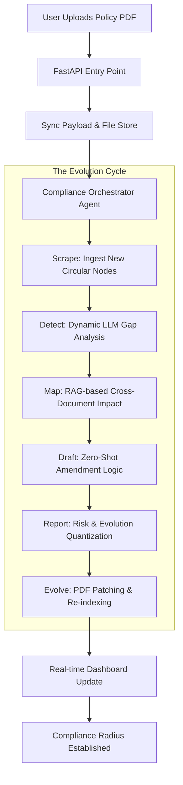

# Compliance OS

**The Autonomous Regulatory Evolution Engine**

Compliance OS is a high-fidelity, autonomous multi-agent platform designed to navigate the complex landscape of regulatory changes for financial institutions. It bridges the gap between static internal policies and the dynamic nature of regulatory circulars (RBI, SEBI, MCA) through real-time AI orchestration.

## 🔴 The Problem Statement: Regulatory Inertia
In the current financial landscape, compliance is a manual, reactive, and high-risk process. The gap between regulatory intent and organizational action is widening due to:
- **Manual Overhead**: Compliance officers spend thousands of hours manually diffing complex PDFs and updating internal manuals.
- **Regulatory Drift**: Internal policies often fall months behind new guidelines, leading to massive penalty exposure and operational risk.
- **Execution Gap**: Static reports only identify problems; they don't fix them. There is no automated bridge from "Reading a Circular" to "Updating a Global Policy."

## 🟢 Our Solution: The Evolution Engine
Compliance OS transforms compliance from a static checklist into an **Autonomous Evolution Cycle**. By deploying a specialized multi-agent swarm, we provide:
- **Zero-Shot Gap Auditing**: Rather than simple text diffing, our engine performs real-time zero-shot document auditing against new regulatory nodes.
- **Self-Healing Policies**: The system doesn't just report; it **amends**. It physically injects professional, color-coded amendments into internal policy PDFs.
- **Telemetry & Traceability**: Each change is mapped to a unique Trace ID, providing a complete audit trail from regulatory source to policy patch.
- **Risk Quantization**: Using historical enforcement data, we provide exact penalty estimates (in Lakhs) and risk probability scores.

## 🏗 System Architecture & Workflow

Compliance OS is built on a modular **Single-Agent Swarm** architecture that separates perception, reasoning, and action.

### The Pipeline Stack
1.  **Frontend (Next.js 15)**: A high-fidelity, monochromatic UI built for speed and clarity.
2.  **Backend (FastAPI)**: Orchestrates the background lifecycle, managing document state and concurrency.
3.  **Vector Intelligence (ChromaDB)**: A local-first vector database for RAG (Retrieval Augmented Generation) and document indexing.
4.  **Local LLM (Ollama)**: Uses Llama 3.2 for 100% offline, privacy-compliant reasoning and drafting.

### End-to-End Data Workflow



## 📂 Folder Structure
```text
Compliance-Checker/
├── backend/                # Intelligence Layer (Python)
│   ├── crew.py             # Orchestrator & Multi-Step Logic
│   ├── main.py             # API & Background Task Mgmt
│   ├── utils/              # Traceability & Config Helpers
│   └── data/               # Persistent Vector & Doc Store
├── frontend/               # Presentation Layer (Next.js)
│   ├── app/                # App Router (Simulate, Live, Dashboard)
│   ├── components/         # Premium UI Components
│   └── lib/                # API Bridge & Types
└── shared_data/            # Lifecycle State (JSON)
```

## 🛠 Features
- **Linear-Style UI**: Dark mode, Inter typography, and high-contrast visuals for a premium feel.
- **Live Execution Logs**: Real-time terminal streaming via the UI of every background agent action.
- **Self-Healing Logic**: Scores improve on subsequent runs as the AI detects its own previously applied patches.
- **Cross-Sector Impact**: Analyze how a single regulation impacts Finance vs. Tech vs. Healthcare.

## 🚀 Getting Started
```bash
# Start Backend
cd backend
python -m venv venv && source venv/bin/activate
pip install -r requirements.txt
uvicorn main:app --reload

# Start Frontend
cd frontend
npm install
npm run dev
```
